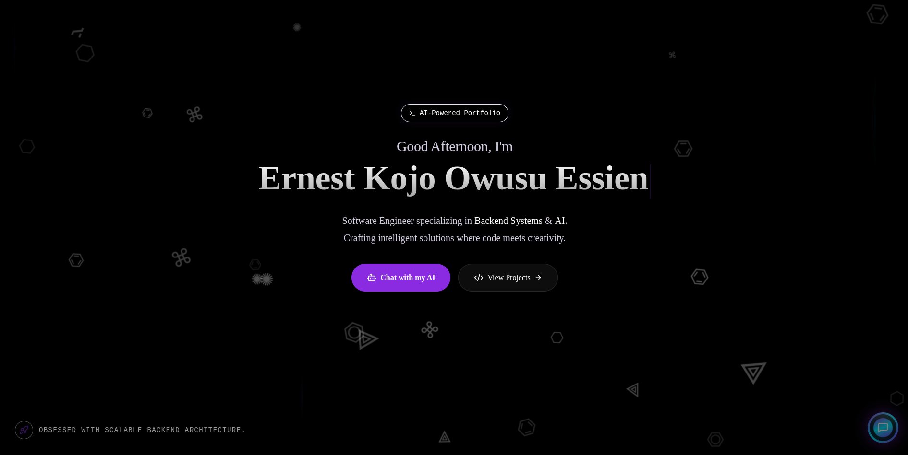
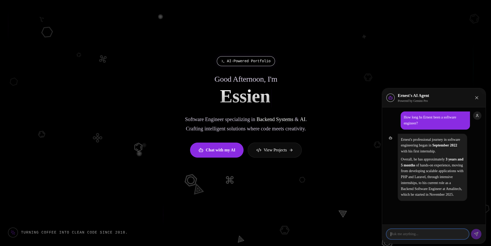
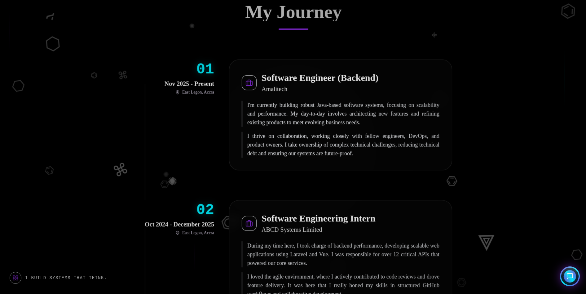

# 🌌 The Void Alchemist | Next.js AI Portfolio



A "Void Alchemist" themed portfolio built with **Next.js 14**, **Tailwind CSS**, and **Framer Motion**, featuring a context-aware **AI Chatbot powered by Google Gemini** (RAG-enabled) and deployed on **Google Cloud Run**.

> *"I build systems that think."*

## ✨ Features

- **🔮 Void Alchemist Aesthetic**: Deep "Obsidian" dark mode with neon cyan accents, glassmorphism, floating code sigils, and a multi-layered atmospheric background.
- **🧠 AI Agent Integration**:
  - Powered by **Google Gemini 1.5 Flash**.
  - **RAG System**: The AI reads this repo's documentation to answer specific questions about my projects and architecture.
  - Generative UI: Can analyze resumes or project ideas on the fly.
  - Crystal Orb Interface: A futuristic, animated trigger button.
- **🎭 Cinematic UI**:
  - Translucent "Atmosphere Layer" for depth.
  - "Torch Cursor" effect tracking mouse movement.
  - Film Grain and Vignette overlays.
- **📨 Functional Contact Form**:
  - Integrated with **Web3Forms**.
  - Custom "Neon Green" success/error notifications.
- **☁️ Cloud-Native**:
  - Containerized with Docker (multi-stage build).
  - Deployed on **Google Cloud Run** for serverless scaling.



## 🛠️ Tech Stack

- **Framework**: [Next.js 14](https://nextjs.org/) (App Router)
- **Styling**: [Tailwind CSS](https://tailwindcss.com/)
- **Animation**: [Framer Motion](https://www.framer.com/motion/)
- **AI**: [Google Generative AI SDK](https://www.npmjs.com/package/@google/generative-ai) (Gemini)
- **Icons**: [Lucide React](https://lucide.dev/)
- **Forms**: [Web3Forms](https://web3forms.com/)
- **Database**: Firebase Firestore (Data & Messaging)
- **Deployment**: Google Cloud Run (Docker)

## 🚀 Getting Started

### 1. Clone & Install
```bash
git clone https://github.com/yourusername/ai-portfolio.git
cd ai-portfolio
npm install
```

### 2. Environment Variables
Create a `.env.local` file in the root:
```bash
# Google AI Studio Key
GEMINI_API_KEY=your_gemini_api_key_here

# Web3Forms Access Key (for contact form)
NEXT_PUBLIC_WEB3FORMS_ACCESS_KEY=your_web3forms_key_here

# App URL (Production)
NEXT_PUBLIC_APP_URL=https://your-cloud-run-url.run.app
```

### 3. Run Locally
```bash
npm run dev
```
Visit `http://localhost:3000`.

## ☁️ Deployment

This project includes a **one-click deployment script** for Google Cloud Run.

### Prerequisites
- Google Cloud SDK (`gcloud`) installed and authenticated.
- A Google Cloud Project with billing enabled.

### Deploying
The `deploy.sh` script automates enabling APIs, building the container, deploying to Cloud Run, and cleaning up old image versions to save costs.

```bash
chmod +x deploy.sh
./deploy.sh
```

> **Note**: The script loads environment variables automatically from `.env.local`.



## 📂 Project Structure

```
├── app/
│   ├── (admin)/admin/   # Protected Admin Dashboard (Projects, Skills, Messages)
│   ├── actions.ts       # Server Actions (Revalidation & AI Logic)
│   ├── layout.tsx       # Global UI (Floating Sigils, Grain, Atmosphere)
│   └── page.tsx         # Main Landing Page (Cached)
├── components/
│   ├── atmosphere-layer.tsx # Translucent depth effect
│   ├── chatbot.tsx      # AI Assistant UI
│   ├── contact.tsx      # Web3Forms Integration
│   ├── floating-sigils.tsx # Background Animation
│   └── footer.tsx       # System Status & Links
├── lib/
│   ├── project-docs/    # Markdown files for RAG context
│   ├── db.ts            # Firestore Client & Subscription Logic
│   ├── cached-data.ts   # Cached Server-Side Data Fetchers
│   └── portfolio-data.ts# Static data (Experience, Projects)
├── deploy.sh            # Deployment Automation
└── Dockerfile           # Production Image Config
```

## 🏆 Credits

Built by **Ernest Kojo Owusu Essien** for the **Google AI "New Year, New You" Challenge**.
