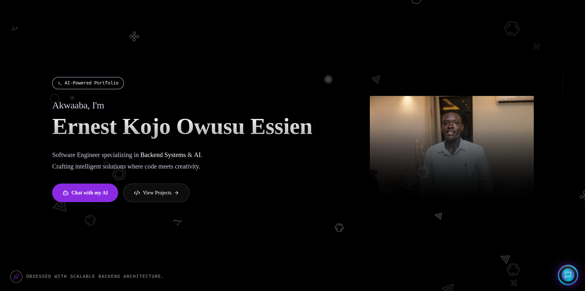
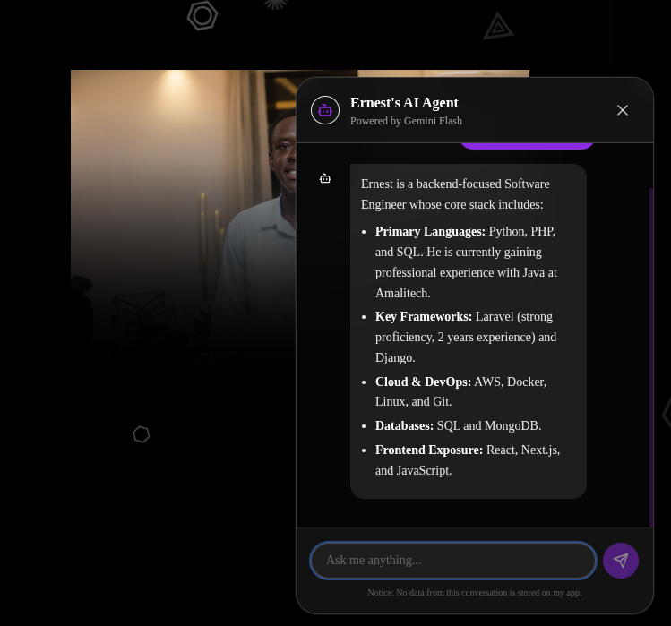
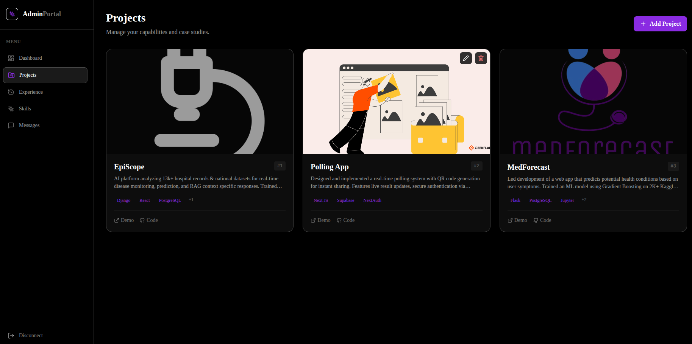
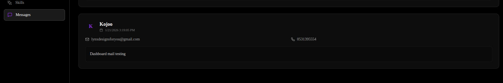
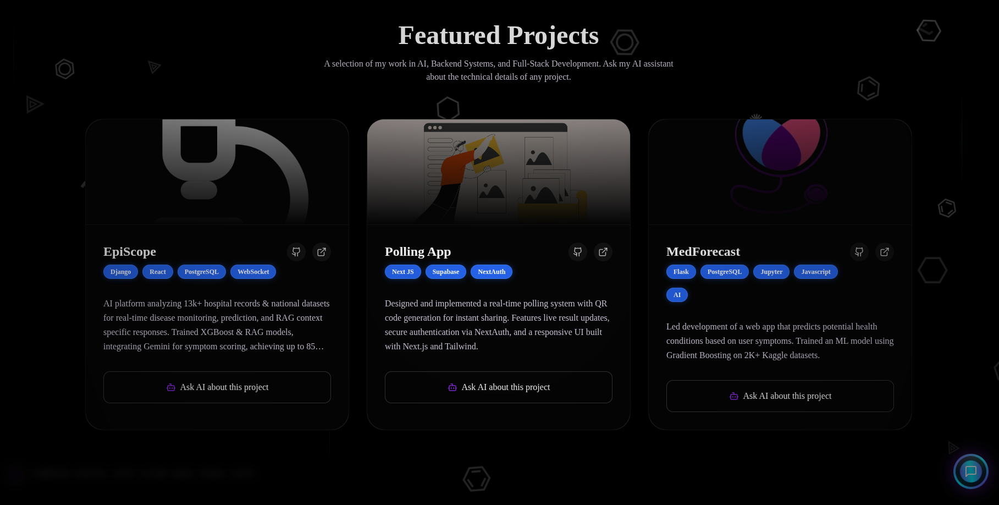
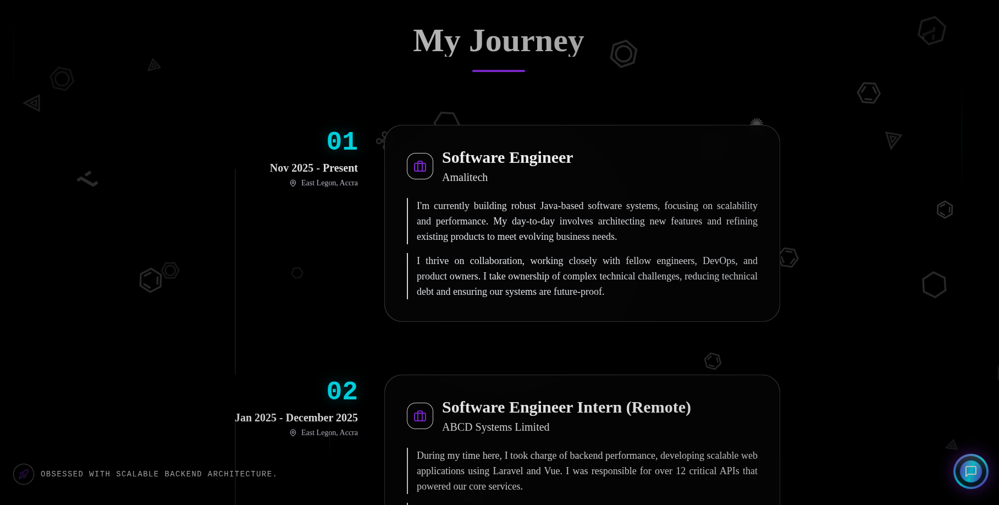
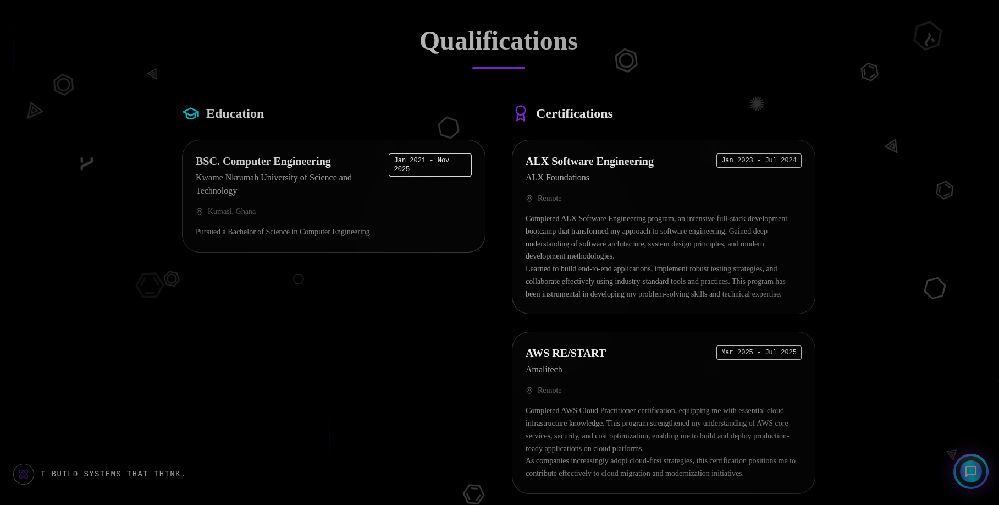

# 🌌 The Void Alchemist | Next.js AI Portfolio



A "Void Alchemist" themed portfolio built with **Next.js 14**, **Tailwind CSS**, and **Framer Motion**. It features a context-aware **AI Chatbot powered by Google Gemini** (RAG-enabled), a fully dynamic **Admin Dashboard** backed by **Firebase**, and is deployed on **Google Cloud Run**.

> *"I build systems that think."*

## ✨ Key Features

### 🎨 The "Void Alchemist" Aesthetic
Designed to be a living digital artifact.
- **Atmosphere Layer**: A translucent depth-of-field effect that sits between the content and the background.
- **Floating Sigils**: Animated code symbols drifting in the void.
- **Cinematic UI**: Glassmorphism, neon cyan accents, and "Torch Cursor" effects.

### 🌍 Smart Greeting System
A personal touch for every visitor.
- **Location Awareness**: Detects the visitor's country via IP to greet them in their local language (e.g., "Akwaaba" for Ghana, "Bonjour" for France).
- **Time-Aware**: If location access fails, it adapts to the time of day ("Good Evening").

### 🧠 Intelligent AI Agent


This isn't just a chatbot; it's a partner.
- **Powered by Google Gemini 1.5 Flash**: Fast, intelligent, and cost-effective.
- **RAG (Retrieval-Augmented Generation)**: The agent has read-access to my private documentation (markdown files). Ask it about "Episcope" or "MedForecast", and it retrieves the exact tech stack and architecture details.
- **Adaptive Persona**: Switches between "Recruiter Mode" (concise, metrics-heavy) and "Dev Mode" (technical deep-dives) based on who it's talking to.

### 🎛️ Dynamic Admin Dashboard


The portfolio is fully dynamic. I don't touch code to update my content.
- **Project Management**: Add, edit, or remove projects directly from the Admin Panel. Changes reflect instantly on the main site.
- **Message Center**: 
  Contact form submissions are saved to **Firestore**. I can read and conduct triage on messages without checking my email.
- **Skill & Experience Management**: Update my timeline and tech stack on the fly.

### 🚀 Immersive Content Sections
**Featured Projects**


**Experience Journey**


**Qualifications & Skills**


---

## 🛠️ Tech Stack

### Core
- **Framework**: [Next.js 14](https://nextjs.org/) (App Router, Server Actions)
- **Language**: TypeScript
- **Styling**: [Tailwind CSS](https://tailwindcss.com/) & [clsx](https://github.com/lukeed/clsx)
- **Animation**: [Framer Motion](https://www.framer.com/motion/)

### Data & Backend
- **Database**: **Firebase Firestore** (Projects, Messages, Experience data)
- **Auth**: **NextAuth.js** (Admin protection)
- **Forms**: **Web3Forms** (Email redundancy) + Firebase (Persistence)

### AI & Intelligence
- **Model**: **Google Gemini 1.5 Flash**
- **SDK**: Google Generative AI SDK
- **Technique**: In-Context Retrieval Augmented Generation (RAG)

### Infrastructure
- **Container**: Docker (Multi-stage build)
- **Deployment**: **Google Cloud Run** (Serverless, Auto-scaling)

---

## 🚀 Getting Started

### 1. Clone & Install
```bash
git clone https://github.com/yourusername/ai-portfolio.git
cd ai-portfolio
npm install
```

### 2. Environment Variables
Create a `.env.local` file in the root:
```bash
# Google AI Studio Key
GEMINI_API_KEY=your_gemini_api_key_here

# Firebase Config (Client)
NEXT_PUBLIC_FIREBASE_API_KEY=...
NEXT_PUBLIC_FIREBASE_AUTH_DOMAIN=...
NEXT_PUBLIC_FIREBASE_PROJECT_ID=...
# ... other firebase config

# Firebase Admin (Server Service Account)
FIREBASE_PROJECT_ID=...
FIREBASE_CLIENT_EMAIL=...
FIREBASE_PRIVATE_KEY=...

# Admin Auth
ADMIN_EMAIL=your_email@example.com

# Web3Forms Access Key (Optional backup)
NEXT_PUBLIC_WEB3FORMS_ACCESS_KEY=your_web3forms_key_here
```

### 3. Run Locally
```bash
npm run dev
```
Visit `http://localhost:3000`.

---

## ☁️ Deployment

This project acts as a standalone artifact, ready for the cloud.

### Automated Deployment to Google Cloud Run
The included `deploy.sh` script handles everything:
1.  Enables necessary Google Cloud APIs.
2.  Builds the Docker image.
3.  Pushes to Google Container Registry (GCR).
4.  Deploys to Cloud Run with environment variables.
5.  Cleans up old images to save storage costs.

```bash
chmod +x deploy.sh
./deploy.sh
```

---

## 📂 Project Structure

```
├── app/
│   ├── (admin)/admin/   # Protected Admin Dashboard (CMS)
│   ├── (site)/          # Public Portfolio Pages
│   ├── actions.ts       # Server Actions (AI, Revalidation)
│   └── api/             # API Routes
├── components/
│   ├── chatbot.tsx      # AI Assistant UI
│   ├── atmosphere-layer.tsx # Visual Effects
│   └── ...
├── lib/
│   ├── db.ts            # Firebase Client SDK
│   ├── firebase-admin.ts # Firebase Admin SDK
│   └── project-docs/    # Markdown files for RAG context
├── imgs/                # Screenshots & Assets
└── deploy.sh            # Deployment Automation
```

## 🏆 Credits

Built by **Ernest Kojo Owusu Essien** for the **Google AI "New Year, New You" Challenge**.

---

## 📄 License

This project is open source and available under the [MIT License](LICENSE).

**Note on Intellectual Property:**
While the code structure, components, and logic are open for you to use and adapt, the following assets are **Copyright © 2026 Ernest Kojo Owusu Essien** and are **NOT** covered by the MIT license:
-   All personal photos and images in the `imgs/` folder (including my portrait).
-   Specific project descriptions, biography text, and personal data.
-   The "Void Alchemist" branding identity.

Please replace these assets with your own if you fork or clone this repository.
